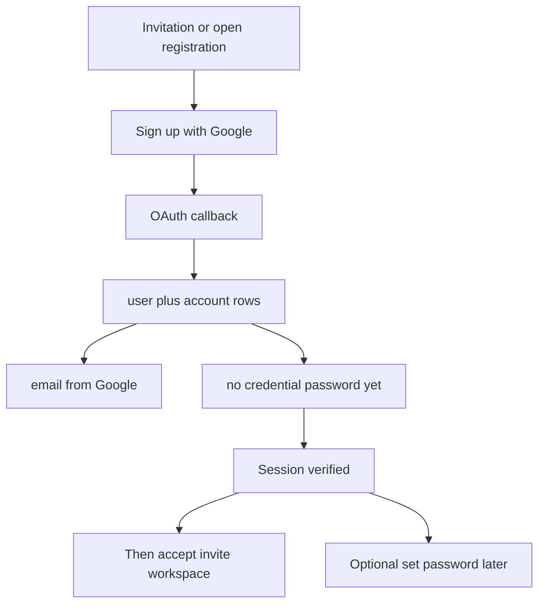
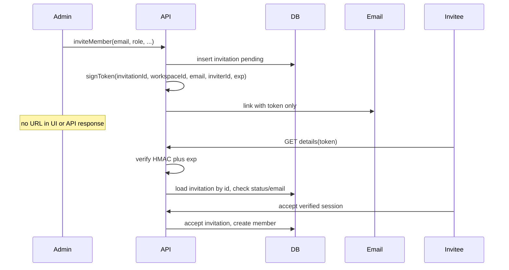

# Allow Google sign-up — plan (PRSM fork)

**Status:** Planned — branch **`prsm/allow_google_signup_first`**.  
**Separate from:** [SMS / text messaging](https://github.com/R4wm/kaneo/tree/prsm/sms-phone-verification/docs/prsm/SMS_PHONE_VERIFICATION.md) (`prsm/sms-phone-verification`).

## Goal

**Add** a supported path: new members may **sign up or sign in with Google** when configured. Persist **email from Google**; Google OAuth is **enough to start** without setting a password. **Email OTP and password sign-up stay fully supported** — this branch does **not** demote or hide password registration.

Password remains **optional** until the user sets one in Account → Security.

Improves onboarding when:

- Email OTP mail is slow or filtered (Google is an additional path, not a replacement).
- Invited users can use Google with their invited Gmail without creating a password first.

**Invitations (same branch):** Admins **never** see the accept URL. Only the invitee’s email contains a link with an **HMAC-signed token** (workspace, email, inviter, expiry). The server verifies the token, confirms the `invitation` row, and accept still writes workspace membership to the database.

## Product rules

| Topic | Rule |
|-------|------|
| **Create account** | **Google OAuth** allowed when instance has `hasGoogleSignIn` and registration rules permit (open reg or valid **invitation** for that Gmail). |
| **Email on user row** | Set from Google profile; treat provider **verified email** as trusted for **new** Google-created users (`emailVerified` true when Better Auth/Google supply verified claim). |
| **Password** | **Not required.** No `credential` account until user chooses “Set password” in settings ([change-password-settings.tsx](../../apps/web/src/components/account/change-password-settings.tsx) already hides change form when no credential). |
| **Sign-in later** | Google OAuth; optional password after set; optional SMS later (other branch). |
| **Email OTP / password** | Unchanged availability and prominence; Google is an **additional** option. |
| **Email OTP before Google** | **Not required** for a **new** Google-created account. |
| **Workspace join** | Only after **`emailVerified`** (see below). |
| **Stale unverified signup** | **First verifier wins** — verified OAuth/OTP displaces unverified row (below). |



## `emailVerified` — required behavior

**Yes.** For Google sign-up to behave like a normal member account, **`email_verified` must become `true` when Google OAuth succeeds with a verified email claim** (Gmail normally supplies `email_verified: true`).

| Scenario | Expected `emailVerified` | Why it matters |
|----------|-------------------------|----------------|
| **New user** created on Google OAuth callback | **`true`** when Google asserts verified email | Pending invitations UI, workspace flows, and “real member” state match email OTP sign-up. |
| **Returning user** signs in with Google again | stays `true` | No regression. |
| **Existing local user** (password/OTP) with `emailVerified: false` on same email | **First verifier wins** (see below) | Real owner can displace a stale unverified signup. |

## First verifier wins (PRSM policy)

**Idea:** An **unverified** email/password signup is a **placeholder**, not a real member. Whoever **proves** they own the email first (Google with verified claim, or email OTP) **wins**; the unverified row is removed and a **fresh verified account** is created.

**Example:** Bully registers `victim@gmail.com` + password, never verifies. Real user signs in with **Google** (or completes **email OTP**) for `victim@gmail.com` → bully’s **unverified user is deleted** → new user from the verified flow with `emailVerified: true`.

### Chosen approach: delete unverified, create fresh (new `user.id`)

On verified claim for email `E`:

1. Find existing user with email `E` and **`emailVerified === false`** (at most one, unique email).
2. Run full account teardown on that user ([`deleteAccountData`](../../apps/api/src/user/controllers/delete-account-data.ts) / admin remove-user path) so sessions, credentials, and FKs are handled intentionally — **not** a raw SQL delete.
3. Proceed with normal OAuth user **create** (or email OTP verify create) for `E` with `emailVerified: true`.

**Keep `requireLocalEmailVerified: true`** for the case **both** sides are already verified (do not merge two verified identities blindly).

## No workspace membership until verification

**Policy:** Do **not** create **workspace membership** (`workspace_member` / org member) or other **verified-only side effects** until the user’s identity is **verified** (`emailVerified: true` from email OTP or trusted OAuth, etc.).

**Why:** If a bully only gets a provisional `user` row (password, unverified) but **cannot accept an invite**, they never receive a `workspace_user_id`-style membership. When the real user verifies first, deleting the placeholder user is low-impact (no workspace rows to orphan). This pairs with **first verifier wins**.

**Today in upstream Kaneo:** Better Auth defaults would require verified email to accept invitations; Kaneo **turned that off** intentionally:

```467:473:apps/api/src/auth.ts
      // Better Auth defaults this to `true`, which blocks any user whose email
      // is not verified from accepting/rejecting an invitation. Kaneo does not
      // verify emails on signup (and guest/anonymous users are unverified by
      // design), so leaving the default on breaks invitation acceptance for
      // everyone. The invitation link id is the actual secret here, so gate on
      // that rather than on email verification.
      requireEmailVerificationOnInvitation: false,
```

**PRSM/fork change for this initiative:**

| Gate | Behavior |
|------|----------|
| **`requireEmailVerificationOnInvitation`** | Set to **`true`** (or equivalent hook) for normal email/password users. |
| **Google OAuth sign-up** | User created with **`emailVerified: true`** → may accept invitation immediately after OAuth. |
| **Email OTP sign-up / verify** | Accept invitation only **after** OTP sets `emailVerified`. |
| **Accept invitation API/UI** | If session user unverified → block accept with clear copy (“Verify your email or continue with Google”). |
| **Guest/anonymous** | Out of scope for PRSM prod (`DISABLE_GUEST_ACCESS`); do not weaken guest rules if enabled elsewhere. |

**Flow:** Email with signed invite link → sign up (Google **or** email OTP) → **verify** → **then** `/invitation/accept/...` creates workspace member. Password-only signup without verify **cannot** join a workspace.

Document exception: **first instance admin bootstrap** (no users yet) if still required by upstream.

## Signed invitation links (PRSM)

### Problem (upstream today)

Kaneo treats the **invitation row id** as the secret:

- URL: `/invitation/accept/{cuid}` ([`buildInvitationLink`](../../apps/web/src/lib/invitation-link.ts), [`sendInvitationEmail`](../../apps/api/src/auth.ts)).
- After invite, **admins see and copy the full URL** ([`InvitationLinkField`](../../apps/web/src/components/team/invitation-link-field.tsx) in [`invite-team-member-modal.tsx`](../../apps/web/src/components/team/invite-team-member-modal.tsx)).
- Accept passes that id to Better Auth ([`accept.$inviteId.tsx`](../../apps/web/src/routes/invitation/accept.$inviteId.tsx)).

Workspace, inviter, role, and project access live in PostgreSQL ([`invitationTable`](../../apps/api/src/database/schema.ts)); the link is an opaque id, not a signed payload.

**PRSM intent:** The **email recipient** gets the only copy of the accept URL. The path carries a **signed (HMAC) token**; the server verifies it, loads the `invitation` row, and accept still creates `workspace_member` via Better Auth hooks in [`auth.ts`](../../apps/api/src/auth.ts).



### Token design (signed payload)

Use **HMAC-SHA256** over a canonical JSON payload (same idea as webhook signing in [`notification-preferences/delivery.ts`](../../apps/api/src/notification-preferences/delivery.ts)), not reversible encryption.

| Field | Purpose |
|-------|---------|
| `invitationId` | Join to `invitation` row (status, project access, expiry) |
| `workspaceId` | Detect tampering vs DB row |
| `email` | Bind link to invited address |
| `inviterId` | Audit / display consistency |
| `exp` | Match or cap `invitation.expires_at` |

- **Secret:** `INVITATION_TOKEN_SECRET` if set, else fall back to the auth secret (document in `.env.sample`; never log tokens).
- **Wire format:** e.g. `base64url(JSON).base64url(hmac)` in route param `/invitation/accept/$token`.
- **Verification:** Constant-time HMAC compare; reject expired or mismatched binding; then existing [`getInvitationDetails`](../../apps/api/src/utils/check-registration-allowed.ts) on the resolved id.

**DB role unchanged:** Token is the bearer secret; **accept still mutates** `invitation.status` and creates membership through Better Auth.

Signed token **does not replace** email verification for password users—it replaces **admin-held URL secrets** and weak reliance on guessing a cuid.

### Admin cannot see the link

| Surface | Change |
|---------|--------|
| [`invite-team-member-modal.tsx`](../../apps/web/src/components/team/invite-team-member-modal.tsx) | Remove [`InvitationLinkField`](../../apps/web/src/components/team/invitation-link-field.tsx); show “Email sent to {{email}}” plus **Resend**. |
| [`use-copy-invitation-link`](../../apps/web/src/hooks/use-copy-invitation-link.ts) | Remove or dev-only if unused. |
| `inviteMember` response | No buildable accept URL; id may remain for cancel/resend lists (id alone is useless without token). |
| [`sendInvitationEmail`](../../apps/api/src/auth.ts) | **Only** place that builds the full URL (signed token + `KANEO_CLIENT_URL`). |
| SMTP missing / send failure | Per [`invitation-email-failure.test.ts`](../../tests/api-integration/invitation-email-failure.test.ts): failure + resend, **never** a copy-link fallback. |

Update i18n (`team.inviteModal.shareLinkDescription` in [`en-US.json`](../../i18n/en-US.json)) to email-sent copy.

### Accept flow and API

1. **New module** [`apps/api/src/invitation/signed-invitation-token.ts`](../../apps/api/src/invitation/signed-invitation-token.ts): `signInvitationToken`, `verifyInvitationToken` (unit tests beside file).
2. **`getInvitationDetails`:** Param is the token string; verify → DB lookup by `invitationId`; token `email` must match row.
3. **Web accept route:** Param is token; **`acceptInvitation`** uses **`invitation.id` from verified GET response** (Better Auth still needs `invitationId`).
4. **Registration / OAuth:** **`x-invitation-id`** from verified invitation id after token lookup on invite landing (or pending-invitations list when logged in).
5. **Backward compatibility (fork):** Prefer token-only new links; optional legacy bare cuid for one release, then remove.

Revise the comment in [`auth.ts`](../../apps/api/src/auth.ts) (~L467–473) that says “invitation link id is the actual secret” when `requireEmailVerificationOnInvitation` is flipped to **`true`** for PRSM.

### Risks to address in implementation (why delete-unverified is sensitive)

| Risk | Mitigation |
|------|------------|
| Bully **accepted an invite** before this gate shipped | Legacy data; ops cleanup. **After gate:** bully cannot accept until verified, so delete-unverified stays clean. |
| Bully verified **before** victim (inbox access) | “First verifier wins” correctly gives bully the account — same as email OTP today. |
| Partial/orphan data | Reuse Kaneo’s existing user deletion controller; add integration tests. |
| Race: two verifications at once | Transaction or unique constraint + retry; test concurrent verify. |

**Upstream note:** This is **stronger** than #1387’s “block link until verified.” Present as PRSM/fork behavior first with tests; upstream may prefer **reclaim row** instead of delete — be ready to discuss.

### Upstream history (context)

- [#987](https://github.com/usekaneo/kaneo/pull/987): enabled OAuth **linking** with `requireLocalEmailVerified: false` (OIDC worked but pre-register risk).
- [#1387](https://github.com/usekaneo/kaneo/pull/1387): set `requireLocalEmailVerified: true` — block link to unverified local account (fix pre-register takeover).

This initiative **does not revert #1387**; it **displaces** unverified rows when a **verified** OAuth/OTP flow arrives for the same email.

### Implementation

1. **Hook** OAuth callback / email OTP verify **before** Better Auth link fails: if conflicting unverified user → delete → allow create.
2. Integration tests: unverified password user → Google verified sign-up → old id gone, new id verified, no credential on bully path.
3. Prove new Google users still get `emailVerified: true` on create.
4. Registration policy + invitation id on OAuth unchanged.

## Current behavior (baseline)

- Sign-up already renders [SSOProviders](../../apps/web/src/components/auth/sso-providers.tsx) / Google on [sign-up.tsx](../../apps/web/src/routes/auth/sign-up.tsx).
- Invite-only OAuth signup is supported when provider email matches a pending invitation ([registration-invitation.test.ts](../../tests/api-integration/registration-invitation.test.ts)).
- Pain point on PRSM: unverified password signup blocks Google (**#1387**). **First verifier wins** (above) plus peer Google on invite addresses this.

## Out of scope (this initiative)

- Bundled SMS / phone work (`prsm/sms-phone-verification`).
- Replacing Google with other providers.
- Changing workspace RBAC (roles/permissions vocabulary).
- Forcing Google-only (email OTP and password remain available where configured).

## Technical work (implementation checklist)

### 0. Signed invitation tokens (recommended first)

1. Token sign/verify + signed URL in `sendInvitationEmail`.
2. API GET details by token; integration tests.
3. Web accept route + accept uses id from verified details.
4. Remove admin copy-link UI; i18n + email-failure UX (no link fallback).
5. OpenAPI: [`apps/api/src/invitation/schema.ts`](../../apps/api/src/invitation/schema.ts) + `pnpm openapi:check:fix`.

| Test area | Cases |
|-----------|--------|
| Token unit | Valid sign/verify; wrong secret; tampered payload; expired |
| Integration | Email mock receives signed URL; admin response has no link |
| Accept | Token URL → details → member; email mismatch fails |
| Email failure | No copy-link fallback |
| Regression | [`registration-invitation.test.ts`](../../tests/api-integration/registration-invitation.test.ts), [`accept.$inviteId.test.tsx`](../../apps/web/src/routes/invitation/accept.$inviteId.test.tsx), invite modal tests |

### 1. Verification before workspace

- Set **`requireEmailVerificationOnInvitation: true`** in [auth.ts](../../apps/api/src/auth.ts).
- Block invitation accept for unverified users in UI and API; route to email OTP or Google.
- Tests: unverified cannot join workspace; verified Google user can.

### 2. First verifier wins

- On verified OAuth or email OTP for email E: delete unverified user with E via [`deleteAccountData`](../../apps/api/src/user/controllers/delete-account-data.ts), then create verified user.

### 3. OAuth user creation

- Confirm Google create sets `emailVerified: true`; pass **`x-invitation-id`** on invite sign-up/sign-in flows.

### 4. Web — onboarding UX

- **Sign-up (invite):** When `hasGoogleSignIn`, show Google **alongside** email/password/OTP with **equal prominence**; copy example: “Continue with Google” (optional: “no password required for this path”).
- **Sign-in:** Same parity; do not remove or de-emphasize password or email OTP.
- **After Google session:** If no credential account, show **“Set a password (optional)”** in Security — reuse or extend set-password flow if missing (today UI may only expose *change* password).
- **Errors:** Map Better Auth linking errors to actionable copy for invite mismatch vs wrong Google account.

### 5. Optional set-password (if not present)

- Better Auth / Kaneo: allow **first** password set for Google-only users (creates `credential` provider) without “current password”.
- Tests: Google-only user → set password → can sign in with email+password.

### 6. Config / PRSM env

- Document recommended PRSM combo: `hasGoogleSignIn`, invitations, optionally `DISABLE_PASSWORD_REGISTRATION` to reduce accidental password-first signup (evaluate — may stay false for admins who want password).
- No new env required if Google client already configured ([FUNDAMENTALS](https://github.com/R4wm/kaneo/tree/prsm/sms-phone-verification/docs/prsm/FUNDAMENTALS.md) on SMS branch / prod runbook).

### 7. Tests

| Case | Assert |
|------|--------|
| Unverified cannot accept invite | acceptInvitation fails until verified |
| Invite + Google create | User with Google email, `emailVerified`, no credential; can accept |
| Invite + Google wrong email | Registration denied |
| Google-only session | Authenticated; workspace invite accept works |
| Set password optional | After set, credential exists; Google still works |
| Unverified placeholder + Google verify | Old user deleted; new verified OAuth user |
| Two verified same email | Still blocked / no silent merge (regression) |
| Signed invite token | Tampered/expired rejected; accept only with verified session + matching email |
| Admin invite UX | No URL shown; resend only |

### 8. Docs

- PRSM runbook: optional member flow “Accept invite → Continue with Google **or** email OTP/password.”
- Update email auth checklist: document Google sign-up path for Gmail invitees (peer to email).

## Upstream

Prefer a **focused PR** to usekaneo/kaneo: invitation header on social sign-up, optional set-password for OAuth-only users, tests + copy — without PRSM-only env docs in upstream.

## Verification (manual)

1. Invite a Gmail address; confirm admin UI shows email sent **without** a copy-link field.
2. Open link from email (signed token) → sign up with Google (same email).
3. Land in workspace; confirm no password set.
4. Sign out → sign in with Google again.
5. Optionally set password → sign in with password.

## References

- [Better Auth Google](https://www.better-auth.com/docs/authentication/google)
- Kaneo `requireLocalEmailVerified` in [auth.ts](../../apps/api/src/auth.ts)
- PRSM email checklist (SMS branch): `docs/prsm/EMAIL_AUTH_TEST_CHECKLIST.md`
