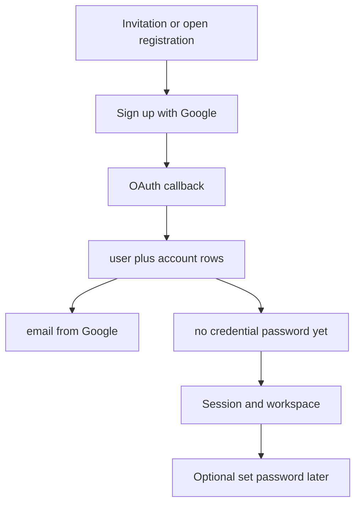

# Allow Google sign-up — plan (PRSM fork)

**Status:** Planned — branch **`prsm/allow_google_signup_first`**.  
**Separate from:** [SMS / text messaging](https://github.com/R4wm/kaneo/tree/prsm/sms-phone-verification/docs/prsm/SMS_PHONE_VERIFICATION.md) (`prsm/sms-phone-verification`).

## Goal

**Add** a supported path: new members may **sign up or sign in with Google** when configured. Persist **email from Google**; Google OAuth is **enough to start** without setting a password. **Email OTP and password sign-up stay fully supported** — this branch does **not** demote or hide password registration.

Password remains **optional** until the user sets one in Account → Security.

Improves onboarding when:

- Email OTP mail is slow or filtered (Google is an additional path, not a replacement).
- Invited users can use Google with their invited Gmail without creating a password first.

## Product rules

| Topic | Rule |
|-------|------|
| **Create account** | **Google OAuth** allowed when instance has `hasGoogleSignIn` and registration rules permit (open reg or valid **invitation** for that Gmail). |
| **Email on user row** | Set from Google profile; treat provider **verified email** as trusted for **new** Google-created users (`emailVerified` true when Better Auth/Google supply verified claim). |
| **Password** | **Not required.** No `credential` account until user chooses “Set password” in settings ([change-password-settings.tsx](../../apps/web/src/components/account/change-password-settings.tsx) already hides change form when no credential). |
| **Sign-in later** | Google OAuth; optional password after set; optional SMS later (other branch). |
| **Email OTP / password** | Unchanged availability and prominence; Google is an **additional** option. |
| **Email OTP before Google** | **Not required** for a **new** Google-created account. |
| **Existing password account** | Unchanged: [`requireLocalEmailVerified`](../../apps/api/src/auth.ts) still blocks linking Google to an existing **unverified local** email (anti–account takeover). Targets **new Google sign-ups**, not Option B for all linking cases. |

## `emailVerified` — required behavior

**Yes.** For Google sign-up to behave like a normal member account, **`email_verified` must become `true` when Google OAuth succeeds with a verified email claim** (Gmail normally supplies `email_verified: true`).

| Scenario | Expected `emailVerified` | Why it matters |
|----------|-------------------------|----------------|
| **New user** created on Google OAuth callback | **`true`** when Google asserts verified email | Pending invitations UI, workspace flows, and “real member” state match email OTP sign-up. |
| **Returning user** signs in with Google again | stays `true` | No regression. |
| **Existing local user** (password/OTP) with `emailVerified: false` tries to **link** Google | **Out of scope by default** — still blocked by `requireLocalEmailVerified` | Anti-takeover. Optional **small add-on** in this branch: on successful link when Google email matches `user.email` and provider says verified, set `emailVerified: true` (narrow Option B — document if implemented). |

### Implementation

1. **Prove current behavior** with an integration test: Google OAuth create (mock or test provider) → `user.emailVerified === true`.
2. If Better Auth **does not** set the flag for Google on create, fix in [auth.ts](../../apps/api/src/auth.ts) via supported config (e.g. map profile / trusted provider verified-email handling) or a **`databaseHooks.user.create` / post-OAuth update** that sets `emailVerified: true` only when the provider verified-email claim is true — **never** for unverified provider emails.
3. Registration policy already treats OAuth with `emailVerified: true` like other verified flows ([registration-policy.test.ts](../../tests/api-integration/auth-registration-policy.test.ts)).

Do **not** globally disable `requireLocalEmailVerified` without the narrow link-time update above.

## Current behavior (baseline)

- Sign-up already renders [SSOProviders](../../apps/web/src/components/auth/sso-providers.tsx) / Google on [sign-up.tsx](../../apps/web/src/routes/auth/sign-up.tsx).
- Invite-only OAuth signup is supported when provider email matches a pending invitation ([registration-invitation.test.ts](../../tests/api-integration/registration-invitation.test.ts)).
- Pain point on PRSM: members who **create a password account first** with `email_verified` still false see **Google link/sign-in fail** until local email is verified — UX should offer **Google sign-up on a fresh invite** (peer paths) or implement narrow link-time verify above.

## Out of scope (this initiative)

- Bundled SMS / phone work (`prsm/sms-phone-verification`).
- Replacing Google with other providers.
- Changing workspace RBAC or invitation model.
- Full “Option B” (trust Google verify to fix **existing** unverified local accounts) — separate small auth PR if still needed.
- Forcing Google-only (email OTP and password remain available where configured).

## Technical work (implementation checklist)

### 1. Verify OAuth user creation

- Confirm Better Auth sets `email` + `emailVerified` from Google on **new user** create (integration test on fork).
- Confirm `databaseHooks.user.create` + [`assertUserRegistrationAllowed`](../../apps/api/src/utils/registration-policy.ts) allow OAuth callback with verified provider email + invitation when `DISABLE_REGISTRATION=true`.
- Pass **`x-invitation-id`** (or query) from sign-up/sign-in Google buttons when user landed from invite link (mirror [verify-otp.tsx](../../apps/web/src/routes/auth/verify-otp.tsx) email OTP).

### 2. Web — onboarding UX

- **Sign-up (invite):** When `hasGoogleSignIn`, show Google **alongside** email/password/OTP with **equal prominence**; copy example: “Continue with Google” (optional: “no password required for this path”).
- **Sign-in:** Same parity; do not remove or de-emphasize password or email OTP.
- **After Google session:** If no credential account, show **“Set a password (optional)”** in Security — reuse or extend set-password flow if missing (today UI may only expose *change* password).
- **Errors:** Map Better Auth linking errors to actionable copy for invite mismatch vs wrong Google account.

### 3. Optional set-password (if not present)

- Better Auth / Kaneo: allow **first** password set for Google-only users (creates `credential` provider) without “current password”.
- Tests: Google-only user → set password → can sign in with email+password.

### 4. Config / PRSM env

- Document recommended PRSM combo: `hasGoogleSignIn`, invitations, optionally `DISABLE_PASSWORD_REGISTRATION` to reduce accidental password-first signup (evaluate — may stay false for admins who want password).
- No new env required if Google client already configured ([FUNDAMENTALS](https://github.com/R4wm/kaneo/tree/prsm/sms-phone-verification/docs/prsm/FUNDAMENTALS.md) on SMS branch / prod runbook).

### 5. Tests

| Case | Assert |
|------|--------|
| Invite + Google create | User with Google email, `emailVerified`, no credential |
| Invite + Google wrong email | Registration denied |
| Google-only session | Authenticated; workspace invite accept works |
| Set password optional | After set, credential exists; Google still works |
| Local unverified + Google link | Still blocked (security regression test) |

### 6. Docs

- PRSM runbook: optional member flow “Accept invite → Continue with Google **or** email OTP/password.”
- Update email auth checklist: document Google sign-up path for Gmail invitees (peer to email).

## Upstream

Prefer a **focused PR** to usekaneo/kaneo: invitation header on social sign-up, optional set-password for OAuth-only users, tests + copy — without PRSM-only env docs in upstream.

## Verification (manual)

1. Create pending invitation for a Gmail address.
2. Open invite link → sign up with Google (same email).
3. Land in workspace; confirm no password set.
4. Sign out → sign in with Google again.
5. Optionally set password → sign in with password.

## References

- [Better Auth Google](https://www.better-auth.com/docs/authentication/google)
- Kaneo `requireLocalEmailVerified` in [auth.ts](../../apps/api/src/auth.ts)
- PRSM email checklist (SMS branch): `docs/prsm/EMAIL_AUTH_TEST_CHECKLIST.md`
