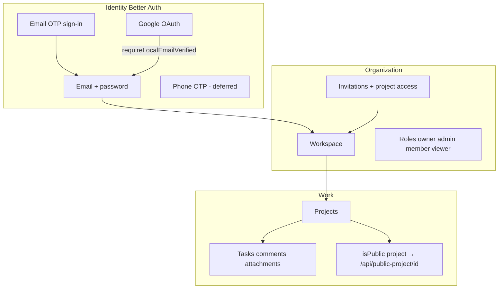

# Kaneo PRSM — fork, fundamentals, bugs, monetization, sharing

Canonical planning doc for PRSM work on Kaneo. Prod [work.prsmusa.com](https://work.prsmusa.com) stays on **pinned upstream image** until a rebased fork build is explicitly approved.

## Fork / branch

| Item | Value |
|------|--------|
| Upstream | [usekaneo/kaneo](https://github.com/usekaneo/kaneo) |
| Base tag | **v2.29.3** (matches prod digest) |
| Branch | **`prsm/planning`** |
| Related doc | [UPSTREAM_SYNC.md](./UPSTREAM_SYNC.md) |

## How Kaneo works (fundamentals for PRSM)

| Concept | Behavior |
|---------|----------|
| **Instance** | Self-hosted single tenant; config via env + `/api/config`. |
| **User** | Email-centric; `email_verified` required before **Google account linking**. |
| **Workspace** | Team container; **DISABLE_WORKSPACE_CREATION** limits who can create one. |
| **Members** | Invited by email; roles + optional **selected projects** only. |
| **Sign-in** | With SMTP: default **email OTP** unless `DISABLE_EMAIL_OTP_SIGN_IN=true`. |
| **Attachments** | S3 presigned uploads; max **`S3_MAX_IMAGE_UPLOAD_BYTES`** (instance-wide; PRSM uses 20 MiB). |
| **Billing (built-in)** | **Creem** when **`KANEO_CLOUD=true`**; self-hosted → `billingEnabled: false`, entitlements unlocked. |
| **Guest** | Anonymous guest plugin if enabled — not the same as public project links. |

## Phase 1 — Stabilize auth and fix bugs

**Goal:** Reliable member onboarding before monetization or SMS.

### Known issues (backlog)

| Issue | Type | Mitigation |
|-------|------|------------|
| Wrong email on account (typo) | Data | Fix user+invitation; confirm spelling with member |
| Gmail SMTP OTP not seen | Deliverability | Spam checks; transactional domain; SMS later |
| Google before `email_verified` | UX / auth | Email OTP first; misleading “registration disabled” |
| `DISABLE_EMAIL_OTP_SIGN_IN` in compose | Config | Use `~/kaneo/.env` only |
| Runbook vs prod registration policy | Docs | Align infra-docs runbook |

### Test user — email auth checklist

1. Invite or register with **exact email**.
2. **Email OTP sign-in** → confirm `email_verified`.
3. **Password sign-in** (if set).
4. **Google link** same email → only after step 2.
5. Negative: Google before verify → link failure, not new account.
6. Logs + `verification` table on failures.

### Upgrade note (security)

Upstream releases frequently (e.g. v2.29.3 → v2.35.0 in ~1 week). Plan **separate digest bump** for fixes such as **`project:share`** on `isPublic` (GHSA-wcf5-rr68-wg5c). Regression-test auth after bump.

## Phase 2 — Read-only sharing

| Mechanism | Scope | Login |
|-----------|--------|-------|
| **`project.isPublic = true`** | Board via `GET /api/public-project/{id}` | No — read-only |
| **Viewer role + selected projects** | Limited projects | Yes |
| **Guest access** | Demo-style | Optional (disabled on PRSM) |

**Not in core:** per-private-ticket magic link without public project.

**Deliverable:** `docs/prsm/public-sharing.md` + staging test project.

## Phase 3 — Monetization and tiers

- Built-in billing: **Creem**, workspace plans — not Stripe, not per-user upload tiers.
- **Stripe** on self-hosted requires fork + custom entitlements (webhooks → plan flags).
- **Premium uploads:** today global `S3_MAX_IMAGE_UPLOAD_BYTES`; tiered limits need presign-time check in fork.

**Deliverable:** `docs/prsm/monetization.md` + presign spike (no prod deploy).

## Phase 4 — SMS / ClickSend (deferred)

- Optional phone sign-in **only after `email_verified`**.
- No `signUpOnVerification`.
- See Kaneo task #6 for related SMS idea; this plan defers until Phase 1–2 complete.

## Fork hygiene

- **`main`**: tracks upstream release tags.
- **`prsm/*`**: PRSM features sized for upstream PRs where possible.
- Merge upstream weekly or before prod pin change.
- Deploy wiring stays in **infra-docs**; app code in **kaneo** fork.

## Execution order

1. Fork + `prsm/planning` + this doc.
2. Fundamentals + runbook sync + bug fixes (config/infra; no custom image).
3. Test user email auth checklist.
4. Public sharing evaluation.
5. Monetization memo + upload-tier spike.
6. Upstream version bump (security).
7. SMS/ClickSend when auth is stable.

## Out of scope (until reprioritized)

- Replacing Creem with Stripe in upstream without a fork.
- Phone-first signup.
- Per-ticket public links without public project or custom build.
