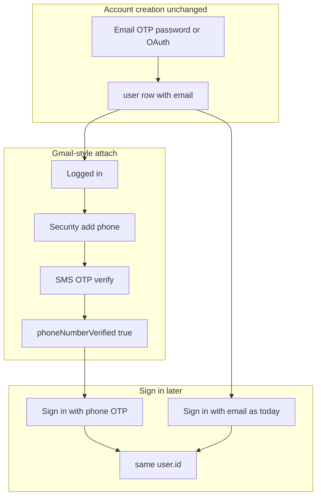

# SMS / text messaging — plan (PRSM fork)

**Status:** Planned — implementation on branch **`prsm/sms-phone-verification`**.  
**Prod:** [work.prsmusa.com](https://work.prsmusa.com) stays on pinned upstream until a fork build with SMS is approved.

## Why

PRSM members **create accounts with email** (OTP, password, OAuth, invitations) as today. **Email OTP deliverability is unreliable** — spam/promotions filters, typos, HTML mail ignored. Users look locked out while the account exists.

**Near term:** Gmail-style **verified phone** on the account + **SMS OTP backup sign-in** when email codes do not arrive.

**Longer term:** Introduce **text messaging** in Kaneo via **`@kaneo/sms`** (provider interface + ClickSend). Auth OTP is the first consumer; later send **transactional SMS** (e.g. task/ticket done, assignments) to users with a verified phone, with opt-in and permissions designed in a follow-up.

---

## Product rules

| Topic | Rule |
|-------|------|
| **Create account** | **Email only** — existing flows. **No phone sign-up.** |
| **Add phone** | Logged in → Account **Security** → E.164 → SMS OTP → number saved with `phoneNumberVerified`. |
| **Sign in** | Email/password/OAuth unchanged. **Also:** SMS OTP if a **verified phone** is on that user. |
| **Link phone to user** | OTP while **authenticated** (or optional skippable step right after email sign-up). No synthetic emails, no merging two accounts. |
| **One phone** | Unique `phone_number` per user when set. |
| **`email_verified`** | SMS sign-in **does not** require email verified. |
| **Invites / registration** | Unchanged — email-centric. |



---

## Out of scope (this phase)

- Phone-first registration (`signUpOnVerification`, phone-only accounts)
- Phone on invitation records
- Hiding or replacing email sign-up/sign-in when SMS is on
- Google / `requireLocalEmailVerified` changes
- **Notification SMS** — done alerts, prefs, quiet hours (reuse `@kaneo/sms` later)

---

## Technical implementation

### 1. `packages/sms` (`@kaneo/sms`)

Shared foundation for auth and future alerts.

| Module | Role |
|--------|------|
| `sms-provider.ts` | `SmsProvider`: `send({ to, body })` |
| `clicksend-provider.ts` | ClickSend REST |
| `sms-config.ts` | `isSmsConfigured()` |
| `index.ts` | `getSmsProvider()`, `sendSms()` |

Env: `CLICKSEND_USERNAME`, `CLICKSEND_API_KEY`, optional `CLICKSEND_SENDER_ID`.  
Pattern: [packages/email](../../packages/email). Plain text bodies; no auth logic inside the provider.

### 2. Database

On `user`:

- `phone_number` (nullable, unique)
- `phone_number_verified` (boolean, default false)

Generate migration: `pnpm --filter @kaneo/api db:generate`.

### 3. API — Better Auth `phoneNumber` plugin

- Enable when `isSmsConfigured()` and not `DISABLE_PHONE_SIGN_IN`.
- **`signUpOnVerification` off** — phone cannot create users.
- `sendOTP` → queue SMS (do not await on request thread).
- Sign-in OTP: send only if user exists with verified phone (`shouldDeliverSignInSms`).
- Attach phone: session required; verify with `updatePhoneNumber: true`.
- Turnstile + rate limits on send-otp paths.
- Admin phone change → clear `phoneNumberVerified` (mirror email admin change).

### 4. Config (`GET /api/config`)

- `hasSms`
- `disablePhoneSignIn`

### 5. Web

- **Sign-up:** no phone UI.
- **Sign-in:** optional “Sign in with phone” when SMS configured (backup copy).
- **Security settings:** add / change / remove phone via OTP.
- **Optional:** after email sign-up, skippable “Add phone for text sign-in codes?”
- i18n: SMS as backup sign-in, not alternate registration.

### 6. Tests

Integration: attach phone, SMS sign-in (including `emailVerified: false`), no user creation from phone sign-up alone, unique phone, email OTP unchanged with SMS enabled.

### 7. Env (fork)

```
CLICKSEND_USERNAME=
CLICKSEND_API_KEY=
CLICKSEND_SENDER_ID=
DISABLE_PHONE_SIGN_IN=false
```

---

## Upstream

This design is suitable for a later **narrow upstream PR**: `@kaneo/sms` + verified phone on email accounts + backup sign-in, without changing registration. PRSM docs stay on the fork.

---

## References

- [ClickSend Send SMS](https://developers.clicksend.com/docs/messaging/sms/other/send-sms)
- [Better Auth phone number plugin](https://www.better-auth.com/docs/plugins/phone-number)
- [PRODUCT_PLAN.md](./PRODUCT_PLAN.md) Phase 4
- [EMAIL_AUTH_TEST_CHECKLIST.md](./EMAIL_AUTH_TEST_CHECKLIST.md)
